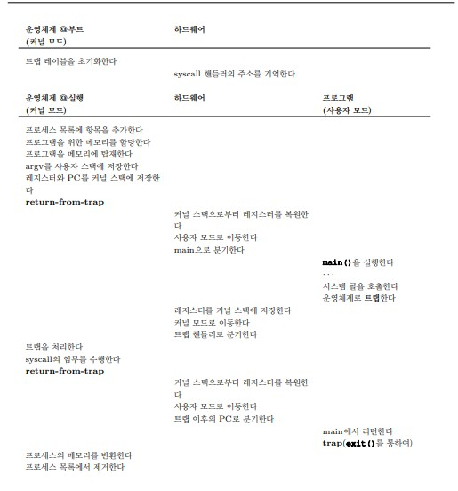

## 제한적 직접 실행 원리

**`CPU 시간을 나누어 씀(시분할 기법)`으로써 CPU 가상화를 구현하기 위해서는 몇 가지 문제 해결이 필요하다.**

1. <i>성능 저하</i> - 시스템에 과중한 오버헤드를 주지 않으면서 가상화를 구현할 수 있을까?
2. <i>제어 문제</i> - CPU에 대한 통제를 유지하면서 프로세스를 효율적으로 실행시킬 수 있는 방법은 무엇인가?

**제한적 직접 실행**

- 운영체제 개발자들은 프로그램을 빠르게 실행하기 위하여 `제한적 직접 실행(Limited Direct Execution)`이라는 기법을 개발하였다.
- `직접 실행`은 말 그대로 프로그램을 CPU 상에서 그냥 실행시키는 것
- `사용자 모드 (user mode)`
- `커널 모드(kernel mode)`
- `시스템 콜(system call)`

```text
# 보호된 제어 양도

하드웨어는 두 가지 실행 모드를 제공하여 운영체제를 돕는다.
사용자 모드에서 응용 프로그램은 하드웨어 접근에 대한 접근 권한이 일부 제한되어 있다.
운영체제는 컴퓨터의 모든 자원에 대한 접근 권한을 커널 모드에서 가진다.
이를 위하여 커널 모드로 진입하기 위한 trap명령어와 사용자 모드로 돌아가기 위한 return-from-trap 명령어가 제공된다.
또한 운영체제가 하드웨어에게 트랩(trap table)의 메모리 주소를 알려주기 위한 명령어도 함께 제공된다.
```

**Limited Direct Execution(제한적 직접 실행) 연대표**

</img>

**싱글 코어라는 가정하에: CPU를 어떻게 다시 획득할 수 있는가**

- CPU에서 프로세스가 실행 중이라는 것은 운영체제는 실행 중이지 않다는 것을 의미한다. CPU에서 실행하고 있지 않다면 운영체제는 어떠한 조치도 취할 수 없다.
- 그렇다면 운영체제는 어떻게 다시 CPU를 획득하여 프로세스를 전환할 수 있는가?

1. 협조 방식: 시스템 콜 기다리기
   - 프로세스들이 합리적으로 행동할 것이라고 신뢰하고, 오랫동안 실행할 가능성이 있는 프로세스는 운영체제가 다른 작업의 실행을 결정할 수 있도록 주기적으로 CPU를 포기할 것이라고 가정한다.
   - 이런 유형의 운영체제는 `yield`시스템 콜을 제공하고, 프로세스가 이 시스템 콜을 호출하면 운영체제에게 제어를 넘겨 다른 프로세스를 실행할 수 있게 한다.

```text
응용 프로그램이 비정상적인 행위를 하게 되면 운영체제에게 제어가 넘어간다.
예를 들어 응용 프로그램이 어떤 수를 0으로 나누는 연산을 실행하거나 접근할 수 없는 메모리에 접근하려고 하면 운영체제로의 트랩이 일어난다.
그러면 운영체제는 다시 CPU를 획득하여 해당 행위를 하는 프로세스를 종료할 수 있다.
```

2. 비협조 방식: 운영체제가 전권을 행사

- 프로세스가 시스템 콜을 호출하기를 거부하거나 실수로 호출하지 않아 운영체제에게 제어를 넘기지 않을 경우 하드웨어의 추가적인 도움없이는 운영체제가 할 수 있는 일은 거의 없다.
- 협조적 방식에서 프로세스가 무한 루프에 빠졌을 경우 할 수 있는 일은 `컴퓨터를 다시 부팅`하는 방법 말고는 없다.

**협조 없이 제어를 얻는 방법**

```text
프로세스가 비협조적인 상황에서도 CPU의 제어를 획득하는 방법은 무엇인가?
악의적인 프로세스가 컴퓨터를 장악하지 않도록 보장하기 위하여 운영체제는 무엇을 할 수 있을까?
  --> 타이머 인터럽트 (timer interrupt)
```

**타이머 인터럽트 (Timer Interrupt)**

- 타이머 장치는 수 밀리 초마다 인터럽트를 발생시키도록 프로그램 가능하다. <br/>
  인터럽트가 발생하면 현재 수행 중인 프로세스는 중단되고 미리 구성된 운영체제의 `인터럽트 핸들러 (Interrupt Handler)`가 실행된다.<br/>
  이 시점에 운영체제는 CPU 제어권을 다시 얻게 되고 자신이 원하는 일을 할 수 있다.

  **문맥의 저장과 복원**

- 운영체제가 제어권을 다시 획득하면 중요한 결정을 내려야 한다.
- 현재 실행 중인 프로세스를 계속 실행할 것인지 아니면 다른 프로세스로 전환할 것인지를 결정해야 한다.
- 이 결정은 운영체제의 `스케줄러(scheduler)`라는 부분에 의해 내려진다.
- 다른 프로세스로 전환하기로 결정되면 운영체제는 `문맥 교환(context switch)`이라고 알려진 코드를 실행한다.

```text
운영체제가 해야하는 작업은 현재 실행 중인 프로세스의 레지스터 값을 커널 스택 같은 곳에 저장하고
곧 실행될 프로세스의 커널 스택으로부터 레지스터 값을 복원하는 것이 전부다.
그렇게 함으로써 운영체제는 return-from-trap 명령어가 마지막으로 실행될 때
현재 실행중이던 프로세스로 리턴하는 것이 아니라 다른 프로세스로 리턴하여 실행을 다시 시작할 수 있다.
```
