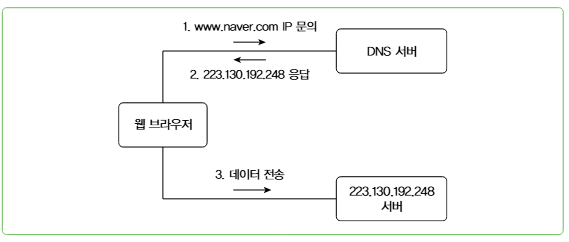
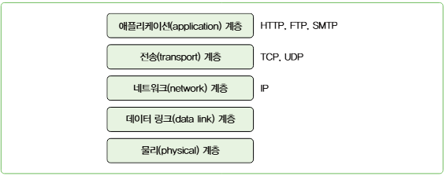

## 10. 네트워크 기초

- 라우터(Router): 네트워크 간에 패킷을 전송하는 역할을 수행

**IP주소와 도메인**
- `IPv4` : 1바이트(8비트) 4개의 숫자 블록으로 구성
- `IPv6` : 128비트 사용
- `Domain Name`, `Domain Name System`

```text
도메인 이름은 계층 구조를 가진다. 도메인 이름의 각 계층은 점(.)으로 구분되며 오른쪽이 상위 계층이고 왼쪽이 하위 계층이다.
가장 오른쪽이 최상위 계층이다. 최상위 계층에는 com, org, net, gov, app, biz, tech 등의 일반 최상위 도메인이나 
kr, jp, au와 같은 국가 최상위 도메인이 있다.

일반 최상위 도메인은 두 번째 계층인 2차 도메인이 도메인의 주요 이름이 된다.
naver.com 이나 google.com에서 naver와 google이 2차 도메인에 해당한다.
3차 이후는 cafe.naver.com, www.google.com과 같이 용도에 맞는 이름을 사용한다.

국가 최상위 도메인은 두 번째 계층까지 미리 정의되어 있다. 예를 들어 ac.kr은 대학 같은 교육 기관 용도로 사용하고
co.kr는 기업 용도로 사용하는 식이다. 국가 최상위 도메인에서는 gasapp.co.kr과 같이 세 번째 계층이 도메인의 주요 이름이 된다.
```


**localhost**
- localhost의 IP 주소는 `127.0.0.1` 이고, `127.0.0.1은 루프백(loopback) 주소로서 자기 자신을 참조할 때 사용하는 IP 주소다.`

**hosts 파일** 
> 각 컴퓨터는 hosts 파일을 가지고 있다. 리눅스에서는 /etc 디렉토리에 위치하고, <br/>
> 윈도우에서는 C:\Windows\System32\drivers\etc 디렉토리에 위치한다. <br/>
> 이 파일은 호스트 이름과 IP 주소에 대한 매핑을 정의한 파일이다. <br/>
> 도메인 서버보다 hosts 파일에 매핑된 설정이 우선이다. <br/>
> 참고로 localhost에 대한 IP 매핑도 이 파일에 정의되어 있다.

- 도메인 이름에 패밍되는 IP 주소는 여러 개일 수 있다. (DNS 레벨에서의 부하 분산 목적)

**고정IP와 동적IP**
- `고정IP`: 서버IP가 대표적, 고정 IP를 사용하는 노드는 IP 주소를 직접 지정한다
- `동적IP`: 노드가 네트워크에 연결할 때마다 IP를 할당, DHCP(Dynamic Host Configuration Protocol)서버를 통해 제공 받는다 <br/>
   인터넷에 연결하려면 IP 주소, 게이트웨이 주소, 서브넷 마스크, DNS 서버 주소를 설정해야 하는데 DHCP 서버가 이 값을 전부 제공 <br/>
  (가정용 공유기가 대표적)

**공인IP와 사설IP**
- 웹 브라우저에 도메인 이름을 입력하여 DNS 서버로부터 IP 주소를 받아 접속하는 경우, 해당 IP 주소는 `공인(public)IP 주소`라고 한다
- 특정 네트워크에 속한 노드에 할당하는 주소로서 네트워크 외부에서 접근할 수 없는 IP 주소를 `사설(private)IP 주소`라고 한다 
- 사설IP로 사용할 수 있는 대역
  - `192.168.x.x`
  - `10.x.x.x`
  - `172.16.x.x ~ 172.31.x.x`

**NAT(Network Address Translation)**
- 네트워크 주소를 변환하는 기술이다 
- 내부에서 사용하는 사설 IP와 인터넷에서 사용하는 공인 IP 주소 간의 변환이 필요한데, NAT가 이 변환을 담당
- 주로 인터넷에 연결된 라우터 같은 네트워크 장비가 담당
```text
라우터는 내부 네트워크에서 나가는 패킷의 사설 IP를 공인 IP로 변환한다.
소스 IP를 변환한다고 해서 이를 SNAT(Source NAT)라고 한다.

공인 IP로 들어온 패킷의 목적지를 사설 IP로 변환하기도 하는데 이를 DNAT(Destination NAT)라고 한다.
```
**VPN(Virtual Private Network)**
- 인터넷과 같은 공용 네트워크에서 서로 다른 네트워크 간에 암호화된 연결을 제공
- 두 네트워크는 마치 하나의 사설 네트워크에 존재하는 것처럼 연결 될 수 있다
- 전용 VPN 클라이언트를 통해 접근할 수 있다

**프로토콜과 TCP, UDP, QUIC**
- 네트워크 상에서 두 노드가 데이터를 주고받기 위해 정의한 규칙을 프로토콜(protocol)이라고 한다
- 네트워크는 여러 계층으로 구성되며 각 계층마다 사용하는 프로토콜이 존재한다

> #### TCP/IP 모델
>  

- `TCP(Transmission Control Protocol)`
  - 연결 기반 프로토콜, 통신을 하는 두 노드 간에 먼저 연결을 수립한 뒤 데이터를 주고 받는다
  - 연결을 수립하기 위한 과정을 `3-Way HandShake`라고 부른다
  - 패킷 순서 보장, 패킷 유실시 재전송 기능 제공 (HTTP, SMTP 등이 TCP를 기반으로 동작)
  - 전송을 보장하기 위한 정보들 때문에 전송 속도가 UDP 대비 느림 
- `UDP(User Datagram  Protocol)`
  - 연결 수립 과정 없이 곧바로 데이터를 전송한다 
  - 데이터가 정상적으로 전송되었는지 알 수 없고, 순서를 보장하지도 않는다
  - 주로 DNS, VoIP, 게임 등에서 사용된다
- `QUIC`: UDP 기반, Http/3 사용 