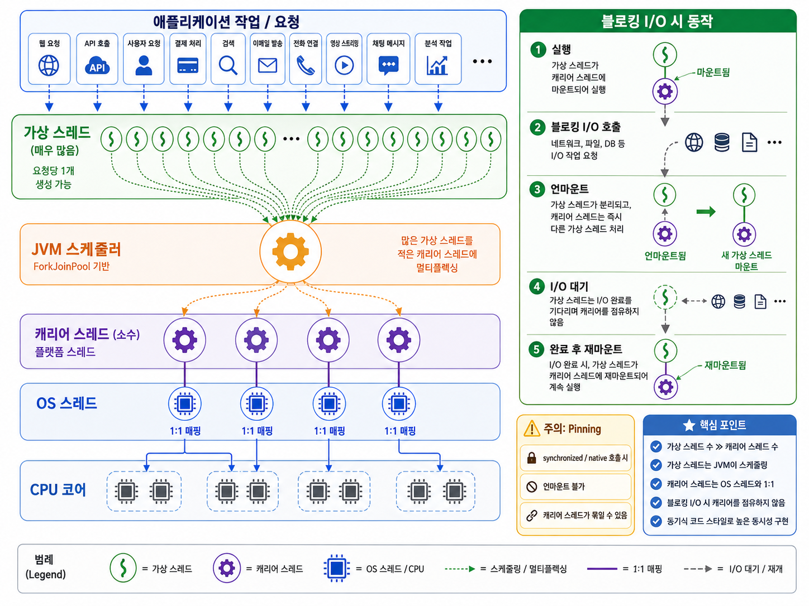

## 7. I/O 병목 해결하기

**네트워크 I/O와 자원 효율**

```text
서버는 HTTP 프로토콜을 이용하여 클라이언트와 데이터를 주고 받는다.
데이터 처리를 위해 DB를 사용하는데 DB는 TCP에 기반한 프로토콜을 사용해서 데이터를 주고 받는다.
레디스를 메모리 캐시로 사용할 때도 네트워크를 통해 데이터를 주고 받는다.
즉, 서버는 네트워크 통신을 기반으로 동작한다. 
```

- 트래픽이 증가하면 다음 2가지 이유로 자원 효율이 떨어진다 (정말 많이 증가해야 체감함...)
  - I/O 대기와 컨텍스트 스위칭에 따른 CPU 낭비
  - 요청마다 스레드를 할당함으로써 메모리 사용량이 높음

- `해결 방안`
1. 서버 수평/수직 확장 - 비용 문제 고려
2. 자원 효율 높이기
    - 가상 스레드 혹은 고루틴 같은 경량 스레드 사용
    - 논블로킹 또는 비동기 I/O 사용

**가상 스레드로 자원 효율 높이기**
```text
경량 스레드는 OS가 관리하는 스레드가 아니라 JVM 같은 언어의 런타임이 관리하는 스레드다.
마치 OS가 CPU로 실행할 스레드를 스케줄링하듯, 언어 런타임이 OS스레드로 실행할 경량 스레드를 스케줄링한다.
```

> [ 가상 스레드 특징 ]
> 1. 플랫폼 스레드(=OS스레드)보다 적은 메모리 사용  (1MB) > (2KB)
> 2. 스레드 생성 시간도 더 빠름 <br/>
>  
> `Thread.ofPlatform().start(() -> {})` <br/>
> `Thread.ofVirtual().start(() -> {})` 

><b>`캐리어(carrier) 스레드`</b> <br/>
> - 가상 스레드를 실행하는 플랫폼 스레드를 캐리어 스레드라고 표현한다.



> [`블로킹 연산과 synchronized`] <br/>
> 가상 스레드가 블로킹 되면, 플랫폼 스레드는 대기 중인 다른 가상 스레드를 실행한다. <br/>
> 반면 자바23 또는 이전 버전에서 `synchronized`로 인해 블로킹 되면, 가상 스레드는 플랫폼 스레드로부터 언마운트 되지 않는다. <br/>
> 즉, 플랫폼 스레드에 고정되었다고(=pinned)고 한다.
> <br/>
> <br/>
> 자바 21 기준으로 `synchronized` 외에도 JNI 호출 등 가상 스레드가 플랫폼 스레드에 고정되는 경우가 있는데,
> 가상 스레드가 고정되면 CPU 효율을 높일 수 없다.

**가상 스레드와 성능**
- I/O 중심 작업(I/O-Bound)
  - `가상 스레드는 I/O 중심 작업일 때 효과가 있다.`
  - 스케줄링에 사용되는 플랫폼 스레드 개수보다 가상 스레드의 수가 많아야 효과를 기대할 수 있다. <br/>
    `따라서 클라우드 환경이라면 CPU 코어 수를 줄이는 방안도 채택할 수 있다.`
- CPU 중심 작업(CPU-Bound) 

**논블로킹 I/O로 성능 더 높이기**
- 사용자가 폭발적으로 증가하면 어느 순간 경량 스레드도 한계가 온다
- 이때는 서버의 I/O 구현 방식을 구조적으로 변경해주어야 ... `블로킹 I/O -> 논 블로킹 I/O`